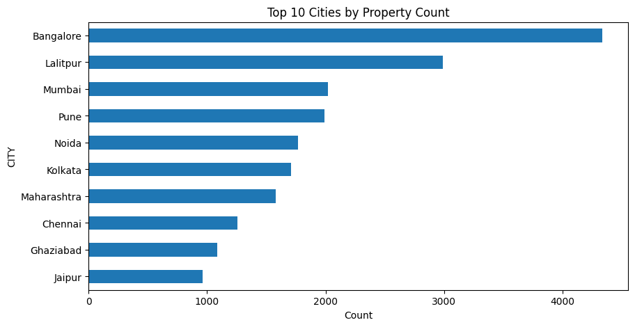

# **🏡 India Housing Price Prediction Model**

## **Project Goal**

The primary objective of this project is to develop a robust regression model to accurately predict residential property prices (TARGET) across major cities in India. The work will focus on creating high-quality features from raw data to ensure the best possible model performance.

---

## **Phase 1: Exploratory Data Analysis (EDA) and Data Transformation**

This initial phase focused heavily on understanding the data's inherent skewness and outlier issues, which are common in real estate datasets, and implementing robust preprocessing to meet the assumptions of linear models.

### **1\. Initial Data Assessment**

The raw data showed critical distributions requiring immediate attention:

* **Severe Right-Skewness:** The target variable (TARGET(PRICE\_IN\_LACS)) and property size (SQUARE\_FT) were highly skewed, with the majority of data points clustered near zero and a long, thin tail extending to extreme values.  
  * *Observation:* This necessitates a log transformation on the target variable.
 
  
  
* **Extreme Outliers:** Several features contained highly influential outliers:  
  * SQUARE\_FT: Included an astronomical value ($\\sim 2.5 \\times 10^8$ sq. ft.) likely indicating a data error.  
  * BHK\_NO.: Contained rare counts (e.g., 20 BHK) that disproportionately affect models.  
  * LATITUDE / LONGITUDE: Showed points outside plausible geographical bounds for India, suggesting input errors.

---

### **2\. Implemented Transformation Pipeline**

The following steps were implemented to clean and transform the numeric features:

| Step | Feature | Transformation Applied | Rationale |
|------|---------|------------------------|------------|
| 1\. Feature Creation | ADDRESS | Extraction of CITY | Created a high-value categorical feature by parsing the last element of the address string. |  
| 2\. Target Transformation | TARGET(PRICE\_IN\_LACS) | np.log1p (Log of $1+x$) $\\rightarrow$ TARGET(PRICE\_IN\_LACS)\_LOG | Normalized the distribution of the target variable to be near-Gaussian, ensuring optimal model fitting. |  
| 3\. Feature Capping | BHK\_NO. | Capped at 6 $\\rightarrow$ BHK\_NO.\_CAPPED | Mitigated the influence of rare, high-BHK outliers. |  
| 4\. Outlier Clipping (IQR) | SQUARE\_FT | Clipped using $1.5 \\times \\text{IQR}$ $\\rightarrow$ SQUARE\_FT\_CLIPPED | Contained the extreme outlier and compressed the tail of the size distribution. |  
| 5\. Outlier Clipping (IQR) | LATITUDE, LONGITUDE | Clipped using $1.5 \\times \\text{IQR}$ $\\rightarrow$ LATITUDE\_CLIPPED, LONGITUDE\_CLIPPED | Ensured geographic coordinates are within a reasonable and defined range. |

### **3\. Transformation Success and Resulting Metrics**

The transformations successfully prepared the data, as evidenced by the post-processing visualizations:

#### **A. Transformed Target Distribution**

The histogram for the log-transformed target variable confirms that the skewness has been effectively removed, resulting in a distribution suitable for linear models.

#### **B. Feature Correlations (Log Price)**

Post-transformation, the correlation analysis shows strong, expected relationships:

* SQUARE\_FT\_CLIPPED correlates highly with TARGET(PRICE\_IN\_LACS)\_LOG (r $\\approx$ **0.80**).  
* BHK\_NO.\_CAPPED shows a strong positive correlation (r $\\approx$ **0.61**).

This confirms that the transformations preserved the core predictive power of the most important numeric features while eliminating noise.

### **Next Steps**

The next phase will involve applying appropriate **encoding techniques** to the high-cardinality (like CITY) and low-cardinality (like POSTED\_BY) categorical features, finalizing the dataset for model selection and training.
